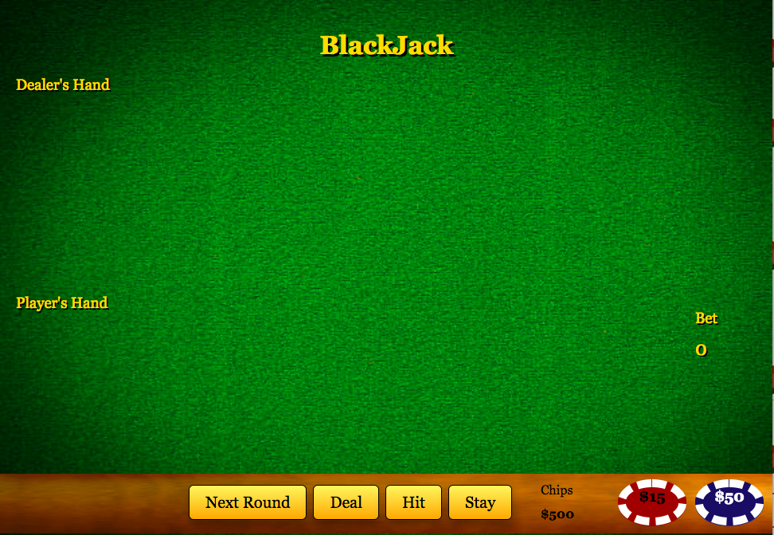
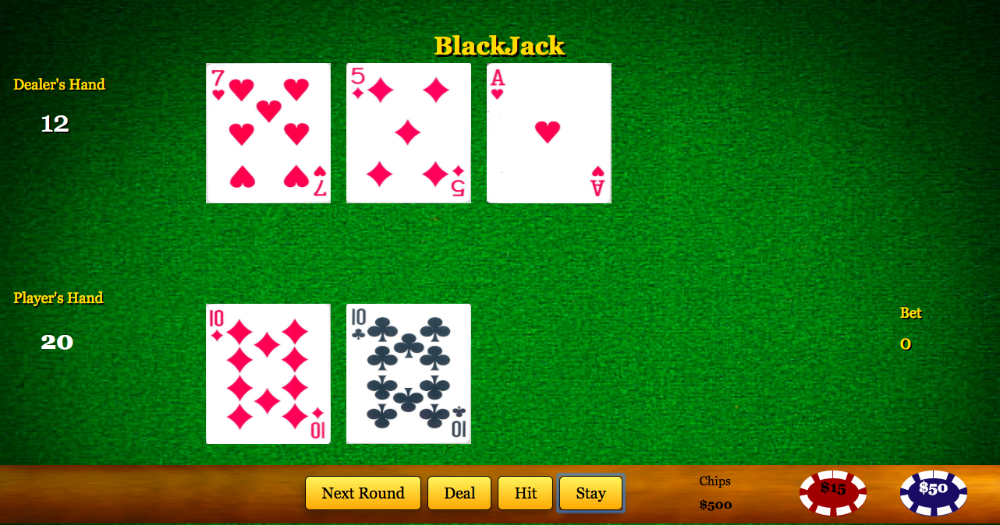
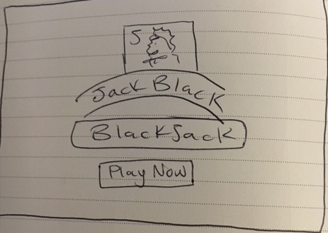
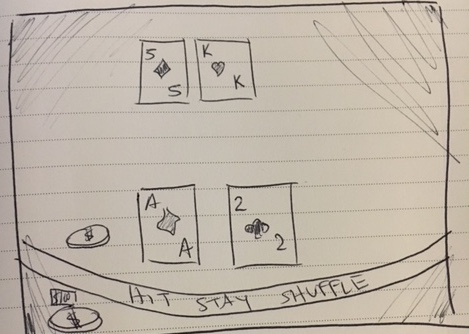

# Blackjack-game

- - - - - - - - - - - - - - - - - - - - - - - - - - - - - - - - - - - - - - - - - - - - - - - - - - - - - - - - - - - - - - - 

## User Stories

User will open game in the browser where they will be greeted with the main Title page "Jackblack Blackjack". 
User will click "Let's Play" where they will be directed to the Instructions page. User should read instructions and when they
are ready they will click for the next page.

The main page will display and the user will click on the coin buttons to wager a bet on the screen for however much they need.
Then, user will click the deal button and they will be dealt cards with the total points to the left of the images. If they want
to hit they will click hit and be dealt another card. User will try to get as close to 21 without busting. Once they decide to stay, 
they will hit stay and the dealers hand will play out. User will have to click stay until the dealer's hand is done.
Finally, the scores will be compared and a winner will be declared. The money will be distribuetd and the user should click
the "next round" button to keep playing. 

## User Story Examples

* 45 year old Male looking to practice his Blackjack skills before a big trip to Vegas. 

* 20 year old male or female just learning to play 21.

* Teenager that loves computer games and card games in one.

* 60 year old female who just loves to gamble

## Deployed App: 

http://chivalrous-mask.surge.sh/

- - - - - - - - - - - - - - - - - - - - - - - - - - - - - - - - - - - - - - - - - - - - - - - - - - - - - - - - - - - - - - - 

 

- - - - - - - - - - - - - - - - - - - - - - - - - - - - - - - - - - - - - - - - - - - - - - - - - - - - - - - - - - - - - - - 

## Technologies

* HTML
* CSS
* Javascript
* Sweetalert for pop up boxes
